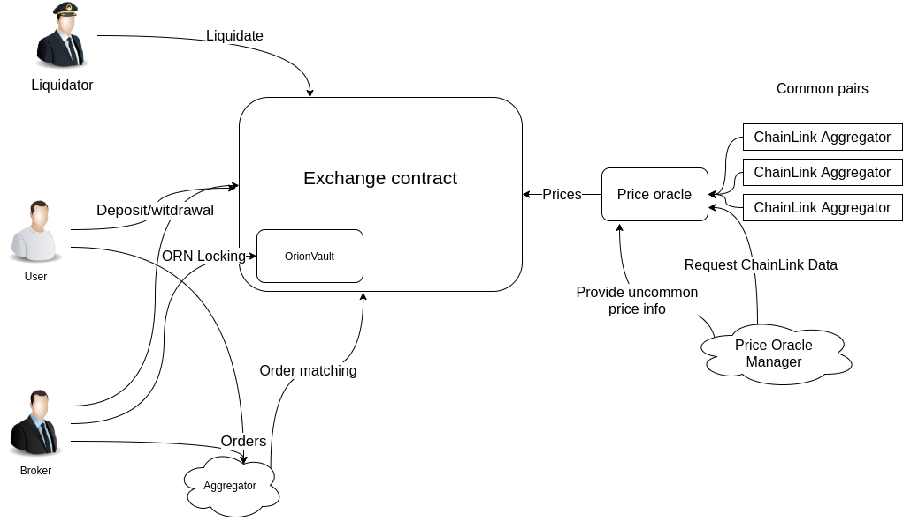
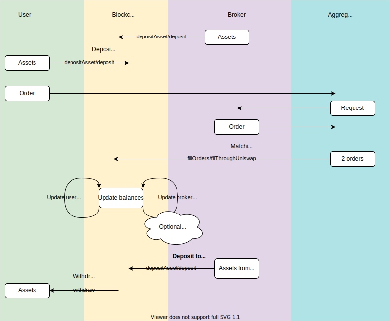
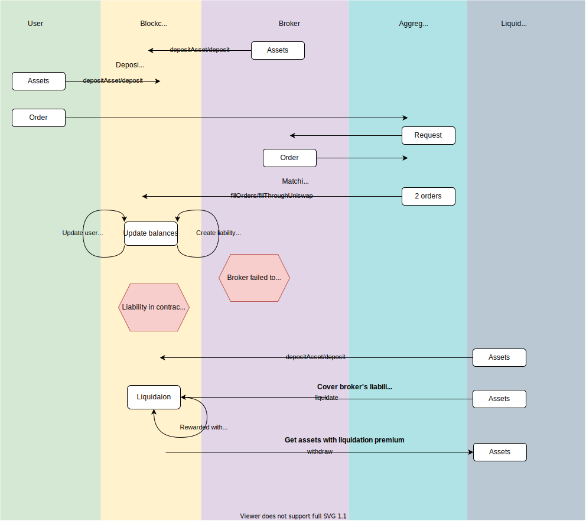

# Orion Exchange

Blockchain part of OrionProtocol consist of the set of smartcontract on Ethereum blockchain which are used to trustless assets deposit/withdrawal, check user' authorization of orders, match orders with safety checks, short-term covered loan granting (to facilitate broker activity) and liquidation of such loans if they become overdue.

Those contracts operate under the following rules:
* Only user can control their funds: no central authority, including orionprotocol matcher/aggregator engine can seize any assets owned by user if user doesn't participate in marginal trading.
* Any marginal trading is intended to be short-term, that is negative position is only available for the period of time long enough to withdraw funds from other liquidity pools.
* Any short-term loan are covered by collateral with substantial excess, to anticipate possible price fluctuations. Only widely trusted assets can be collateral.
* Liquidation mechanism is intended to be accessible to as much parties as possible to make liquidation fast. Liquidation speed and collateral excess ensure solvency of exchange contract during price fluctuations.

## Implementation details

### Exchange
All assets on exchange level are treated as divisible to 10^8 indivisible units. Conversion to real decimals corresponding to that assets occurs on deposit/withdrawal. Coversion functionality is implemented in LibUnitConversion library.

SafeMath logic is not used for gas-cost concerns, instead we only allow those integer variable which can not overflow. Balances inside contract are stored as int192 (note balance may be negative). Allowed input amounts are int112 or uint112: it is enough for all practically used tokens: for instance if decimal unit is 1e18, int112 allow to encode up to 2.5e15 decimal units. That way adding/subtracting any amount from balances won't overflow, since minimum number of operations to reach max int is practically infinite: ~1e24. Allowed prices are uint64. Note, that price is represented as price per 1e8 tokens. That means that `amount*price` always fit uint256, while `amount*price/1e8` not only fit int192, but also can be added and subtracted without overflow checks: number of malicious operations to overflow ~1e13.

Order validation are made in LibValidator library. `validateV3` and `checkOrdersInfo` checks that order is signed by user and also checks that orders are valid at the moment and match with each other.

Implementation of short-term loan mechanism is presented mostly in MarginalFunctionality. In short we allow user to have limited number of liabilities (assets with negative balance). The list of liabilities is stored explicitly and updated on each trade. Also for each trade we calculated position: weighted sum of all assets which can be collateral (by iterating through list allowed collateral assets) and subtract value of liabilities (by iterating through list of liabilities). All calculation are done in ORN. If after trade weighted position is not positive - this trade is incorrect and will be reverted. Broker may cover liability by deposit or trade. We store time of liability creation and value of this liability. Broker should close this liability during `overduePeriod` or he can be liquidated; however broker also may deepen liability during that period and if he manage to cover initial liability value while having additional loans time counter for those new loans will start from zero. Besides negativity, there are possible other incorrect position state: `OVERDUE`, `NOPRICE`, `INCORRECT`, when loan is overdue, price provided by PriceOracle is too old, or position doesn't satisfy other conditions.

Orion locked in `OrionVault` work as "addition" asset type which has higher risk coefficient, that means it has higher weight during position calculation. However, in contrast with simple ORN on the exchange balance they can not be arbitrary withdrawn: first user have to close all liabilities and also weight for release period. Idea behind that mechanism is that brokers with locked ORN has skin in the game, that is share risks with all orion ecosystem and thus it is more expensive to them to try to harm it; in exchange they have better collateral rates.

To have ability to upgrade contract, exchange is developed behind the Proxy. We use standard OpenZeppeling proxy framework, however for safe upgrades we need to preserve contract storage layout. To do that we use inheritance approach. That way initial storage layout is determined by `ExchangeStorage`. Current scheme is as follows: `Proxy` use code of the `Exchange`, and `Exchange` itself is the child of the following inheritance chain: `Exchange`<-`OrionVault`<-`ExchangeStorage`. If during upgrade we need to add new state variable, a new contract inherited from `Exchange` should be implemented and proxy should be pointed to this new contract.

### PriceOracle
Price oracle works as cache of prices obtained from various sources. Initially there were three possible methods to provide price data 1) signed data by oraclePublicKey, 2) data provided by authorized address, 3) chainlink aggregators. Currently, first option is commented out. Price oracle retrieve prices, if necessary, calculates prices relative to ORN from other pairs and stores them to be consimed by Exchange contract.

## Workflows

Standart workflow is shown below. `Mono` font labels on arrows are contract method names for corresponding actions:

However, if broker failed to cover short-term loans in timely manner the liquidator will cover them for broker, however at expense of addiional liquidation premium:

